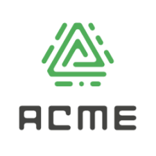
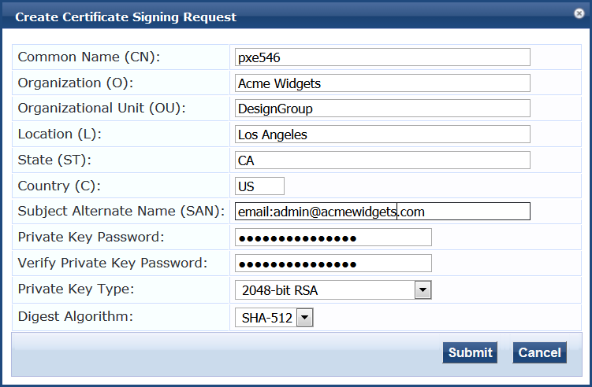
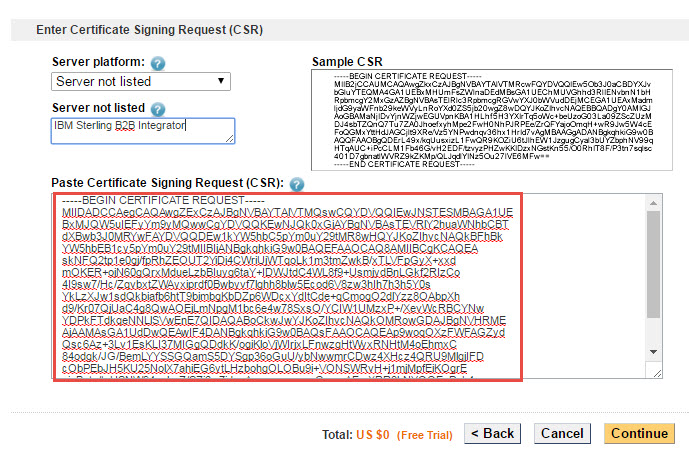
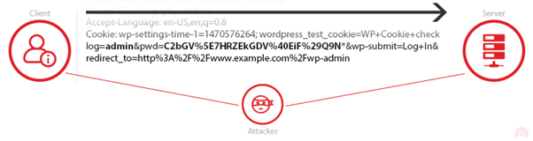
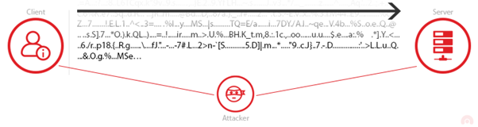
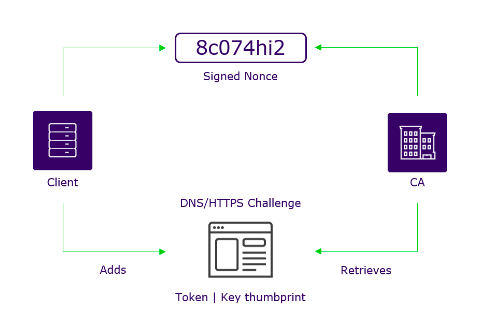
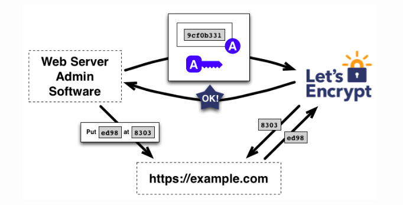

# acme

*acme* is a plugin that automates certificate management: issuance and renewal.

## Description
Certificate mismangement can occur when you manage your certificates manually because:
* All certificates will expire
* Users need to be reminded to renew certificates
* Manpower and time is needed to renew certificates manually
* The process of creating and renewing certificates manually is tedious

Managing certificates manually poses a risk to systems in production because:
* Users can forget to renew certificate until expiration
* Risk of exposure leads to gaps in ownership and hence Man-in-the-Middle attacks and breaches.

The `acme` plugin automatically creates and renews certificates for you, using the [ACME]((https://datatracker.ietf.org/doc/html/rfc8555/)) protocol. This enables more secure communications and certificate management while saving time and manpower which could be put to better use.

### Managing Certificates Manually

To generate a TLS/SSL certificate, you need to do the following:
1. Generate a Certificate Signing Request (CSR) with required details

2. Cut and paste the CSR into a Certificate Authority's (CA) web page

3. Prove ownership of the domain(s) in the CSR by manually resolving the CA's challenges.
4. Download the issued certificate and install it on the server

### Why do you need certificates?
|  |
|:--:|
| Figure 1: Communication without TLS certificate|

Certificates allow you to encrypted communication between the client and the server so that only the intended recipient can access it. Information you send on the Internet is passed from computer to computer to get to the destination server. In Figure 1, your sensitive information like passwords is not encrypted and can be exposed to any server between you and the recipient.

||
|:--:|
|Figure 2: Secure communication with TLS certificate|

In Figure 2, When an SSL/TLS certificate is used, the information becomes unreadable to everyone except for the server you are sending the information to. This protects it from hackers and identity thieves.

## How does ACME work?
In the beginning, the client needs to register an account with a CA and add the domain under it. Then it needs to prove that it owns the domain through domain validation.

### Domain Validation

1. Client first generates a public and private key. Client keeps the private key.
2. The CA issues one or more challenges (DNS/HTTPS/TLS-ALPN) to prove that the client controls the domain.
3. CA also sends a nonce to sign with the private key. This proves that the client controls the public and private keys.
4. Client fulfills the challenge and signs the provided nonce.
5. LetsEncrypt verifies the nonce and checks whether the challenge is fulfilled.
6. Server is authorised to do certificate management for the domain with the key-value pair. The key-value pair is now known as the **authorised** key-value pair.

### ACME Challenges
These challenges are for proving to the CA that the client owns the domain. In this case, we refer to the client as the one requesting for the certificate and the server as the Certificate Authority.
1. [HTTP](https://datatracker.ietf.org/doc/html/rfc8555#section-8.3)
* Client constructs a key authorization from the token in the challenge and the client's account key. 
* Client then provisions it as a resource on the HTTP server for the domain and notifies the server. The key authorization will be placed at **http://{domain}/.well-known/acme-challenge/{token}**.
* Server will try to retrieve the key authorization from the URL and verify its value matches.
2. [DNS](https://datatracker.ietf.org/doc/html/rfc8555#section-8.4)
* Client constructs a key authorization from the token in the challenge and the client's account key. It computes the SHA256 digest of it.
* Client provisions a TXT record with the digest under **_acme-challenge.{domain}**, the validation domain. Client notifies the server.
* Server will try to retrieve the TXT record under the validation domain name and verify its value matches.
3. [TLS-ALPN](https://datatracker.ietf.org/doc/html/rfc8737)
* Known as TLS with Application-Layer Protocol Negotiation (TLS ALPN). It allows clients to negotiate what protocol to use for communication (at the application level).
* Client configures a TLS server to respond to specific
connection attempts using the ALPN extension with identifying
information.
* Client builds a self-signed certificate with the required extensions. The acmeIdentifier extension must contain the SHA256 digest of the key authorization from the token in the challenge. The subjectAlternativeName extension must contain the domain name being validated.
* Server connects to a TLS server at one of the addresses resolved for the domain name and verifies that a certificate with the specified content is presented. It must use port **443**.

### Certificate Issuance

* Server generates a Certificate Signing Request and a public key. It asks the CA to issue a certificate with this public key.
* Server signs the public key in the CSR and the CSR with the **authorised** private key.
* CA verifies both signatures and issues the certificate.
* Server receives the certificate and installs it on the relevant domain.

### Certificate Revocation
Likewise, for revocation, a revocation request is generated and signed with the **authorised** private key. It is then sent to the CA to revoke the certificate.

## Pros and Cons
### Pros
ACME enables automatic renewal, replacement and revocation of domain validated TLS/SSL certificates.

* You no longer have to spend energy and time to keep a watch on their expiry dates and worry about certificates expiring.
* You no longer have to dig out the instructions to renew and configure the certificates.
* You no longer have to worry about data breaches or Man-in-the-Middle attacks that happen when your certificates expire
* Certificates from LetsEncrypt are free!

Just set up ACME once and let it run. At companies, this could save  a lot of manpower and time when there are hundreds of certificates in use.
### Cons
* LetsEncrypt does not offer OV (Organisation Validation) or EV (Extended Validation) certificates as stated in their [FAQ](https://letsencrypt.org/docs/faq/#will-let-s-encrypt-issue-organization-validation-ov-or-extended-validation-ev-certificates).

## Configuration
## Basic
~~~txt
acme {
  domain <DOMAIN>
}
~~~

* `DOMAIN` is the domain name the plugin should be authoritative for.
* Under this configuration, only the **DNS** challenge will be used for ACME.

## Advanced
~~~txt
acme {
  domain DOMAIN

  # optional parameters
  challenge <CHALLENGE> port <PORT>
}
~~~
You can specify one or more challenges the CA can use to verify your ownership of the domain.
* `CHALLENGE` is the name of the challenge you will use for ACME. There are only two options: `tlsalpn` and `http01`.
* `PORT` is the port number to use for each challenge. Make sure the ports are open and accessible.

## Examples
### Basic
~~~txt
acme {
  domain contoso.com
}
~~~
This will perform ACME for `contoso.com` and use the `DNS01` challenge only.

### Advanced
This configuration:
~~~txt
acme {
  domain example.com

  challenge http port 90
  challenge tlsalpn port 8080
}
~~~
This will perform ACME for `example.com` and perform the following challenges:
1. `HTTP` challenge on port **90**
2. `TLSALPN` challenge on port **8080**
3. `DNS` challenge

## How this plugin works with CoreDNS
`ACME` uses challenges to prove that you own the domain. One challenge is `DNS`, which requires adding DNS records on the authoritative nameserver for your domain. This plugin uses [CoreDNS](https://github.com/coredns/coredns) to create and providing the necessary records for solving this challenge. It can also resolve the other challenges separately.

## Installation
This is a CoreDNS plugin so you need to set up CoreDNS.
1. Clone [CoreDNS](https://github.com/coredns/coredns) and add github.com/chinzhiweiblank/coredns-acme into `go.mod`
2. Clone `https://github.com/chinzhiweiblank/coredns-acme`
3. Add `acme:github.com/chinzhiweiblank/coredns-acme` into `plugin.cfg`
4. Run `go mod edit -replace github.com/chinzhiweiblank/coredns-acme=${PATH_OF_PLUGIN}`. This enables you to build CoreDNS with the `coredns-acme` repository you cloned.

## Disclaimer
* Make sure you have the following conditions: 
  * You own the domain
  * Your CoreDNS server is the authoritative nameserver for the domain

## See Also
1. [Challenge Types](https://letsencrypt.org/docs/challenge-types/)
2. [RFC for ACME](https://datatracker.ietf.org/doc/html/rfc8555/)
3. [ACME Protocol](https://www.thesslstore.com/blog/acme-protocol-what-it-is-and-how-it-works/)
